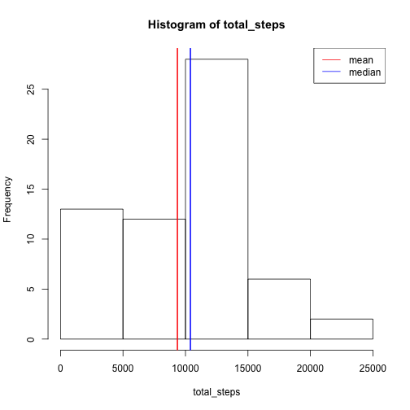
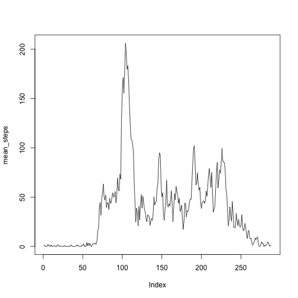
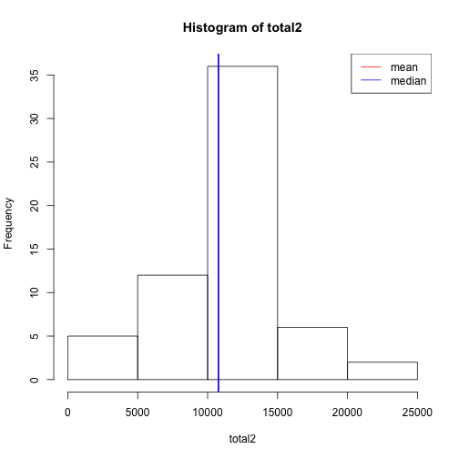
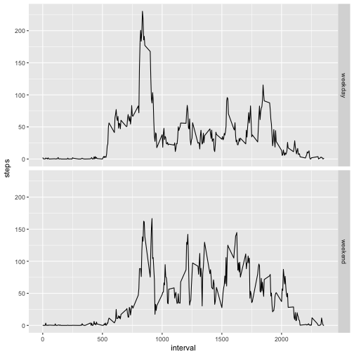

Reproducible Research: Peer Assessment 1
========================================
<!-- rmarkdown v1 -->


## Loading and preprocessing the data


```r
activity <- read.csv("./activity.csv")
```

## What is mean total number of steps taken per day?
 I am going to calculate total number of steps taken per day, and make that histogram to show you how the distribution of total steps looks like.

```r
total_steps<-tapply(activity$steps, activity$date, sum, na.rm=TRUE)
hist(total_steps)
abline(v=mean(total_steps), col = "red", lwd=2)
abline(v=median(total_steps), col = "blue", lwd=2)
legend("topright", col=c("red", "blue"), lty = 1, legend=c("mean", "median"))
```



```r
summary(total_steps)
```

```
##    Min. 1st Qu.  Median    Mean 3rd Qu.    Max. 
##       0    6778   10400    9354   12810   21190
```

## What is the average daily activity pattern?
 Here's a time series plot for 5-minute interval and average number of steps taken.
 This plot tells us which interval on average contains most steps.

```r
mean_steps <- tapply(activity$steps, activity$interval, mean, na.rm=TRUE)
plot(mean_steps, type ="l")
```



```r
which.max(mean_steps)
```

```
## 835 
## 104
```

## Imputing missing values
 There are 2304 missing value in steps.I filled in the mean value for the 5 minute interval, this affects the mean and median value to be the same value, and increase both value. 

```r
length(which(is.na(activity$steps)))
```

```
## [1] 2304
```

```r
dummy <- tapply(activity$steps, activity$interval, mean, na.rm=TRUE)
activity$steps[which(is.na(activity$steps))]<- rep(dummy, 8)
total2 <- tapply(activity$steps, activity$date, sum)
hist(total2)
abline(v = mean(total2), col = "red", lwd=2)
abline(v = median(total2), col = "blue", lwd=2)
legend("topright", col=c("red", "blue"), lty = 1, legend=c("mean", "median"))
```



```r
summary(total2)
```

```
##    Min. 1st Qu.  Median    Mean 3rd Qu.    Max. 
##      41    9819   10770   10770   12810   21190
```
## Are there differences in activity patterns between weekdays and weekends?
 I will show the time series plot to answering this question: Yes, there are differences
 

```r
isweekend <- function(x) {ifelse(weekdays(x)=="Saturday" | weekdays(x)=="Sunday", "weekend", "weekday")}
dates <- as.Date(as.character(activity$date))
activity$week <- isweekend(dates)
library(ggplot2)
df <- aggregate(steps~interval+week, data= activity, mean, na.rm=TRUE)
qplot(interval, steps, data = df, geom="line", facets = week ~ .)
```


